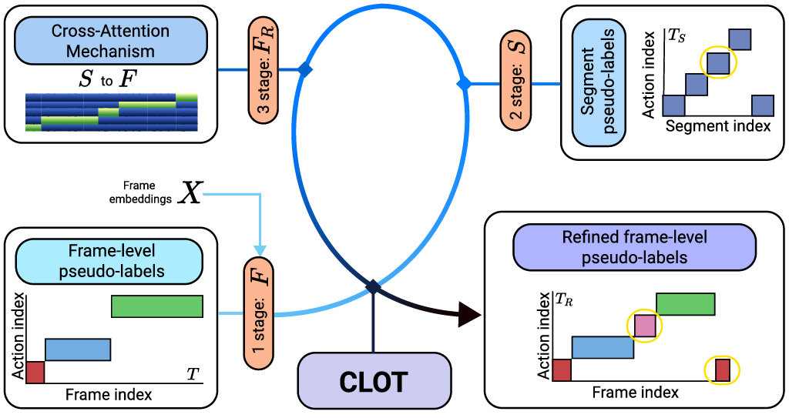
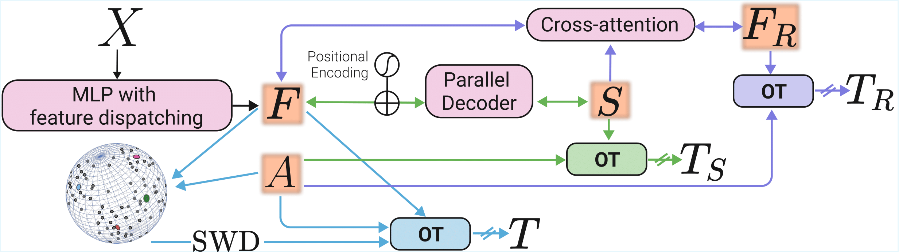

# [ICCV2025] [**CLOT: Closed Loop Optimal Transport for Unsupervised Action Segmentation**](https://openaccess.thecvf.com/content/ICCV2025/papers/Bueno-Benito_CLOT_Closed_Loop_Optimal_Transport_for_Unsupervised_Action_Segmentation_ICCV_2025_paper.pdf)
## Abstract
Unsupervised action segmentation has recently pushed its limits with ASOT, an optimal transport (OT)-based method that simultaneously learns action representations and performs clustering using pseudo-labels. Unlike other OT-based approaches, ASOT makes no assumptions about action ordering and can decode a temporally consistent segmentation from a noisy cost matrix between video frames and action labels. However, the resulting segmentation lacks segment-level supervision, limiting the effectiveness of feedback between frames and action representations. To address this limitation, we propose Closed Loop Optimal Transport (CLOT), a novel OT-based framework with a multi-level cyclic feature learning mechanism. Leveraging its encoder-decoder architecture, CLOT learns pseudo-labels alongside frame and segment embeddings by solving two separate OT problems. It then refines both frame embeddings and pseudo-labels through cross-attention between the learned frame and segment embeddings, by integrating a third OT problem. Experimental results on four benchmark datasets demonstrate the benefits of cyclical learning for unsupervised action segmentation.

<p align="center">
  <br>
  <em>Figure 1: Overview of CLOT.</em>
</p>

**Figure 1:** Given precomputed frame embeddings $X$ as input, CLOT first solves an OT problem to generate pseudo-labels $T$ alongside initial frame embeddings $F$. It then estimates segment embeddings $S$ and pseudo-labels $T_S$ by solving a second OT problem. Finally, a third OT problem is formulated to obtain refined frame embeddings $F_R$ and pseudo-labels $T_R$, by leveraging cross-attention between the learned $F$ and $S$, thereby closing the loop between frame and segment representations.

## Contributions
This repository contains the core implementation of the method proposed in our article.  
All remaining components (e.g., data preprocessing, training and evaluation pipelines, and general framework code) follow the baseline implementation of [`action_seg_ot`](https://github.com/mingu6/action_seg_ot/).
- **Transformer decoder with learned action queries**: we introduce learnable segment and positional embeddings that serve as action queries, producing high-level prototypes that guide frame-to-cluster assignments. [`src/transformer.py`](src/transformer.py)
- **Cross-attention refinement loop**: segmentation codes are stabilized through cross-attention between frame features and action queries before solving the transport problem.[`src/cross-att.py`](src/cross-att.py)
- **Geometric regularization with sliced Wasserstein distance**: a sliced Wasserstein term is added to the cluster centers, dynamically shaping the cost matrix and penalizing geometric discrepancies.[`src/gsw.py`](src/gsw.py)
- **Feature dispatching mechanism**: a differentiable prior encourages monotonic alignment between frame positions and cluster indices, avoiding degenerate solutions on long sequences.[`src/feature_dispatching.py`](src/feature_dispatching.py)
<p align="center">
  <br>
  <em>Figure 2: Diagram of the CLOT architecture.</em>
</p>

**Figure 2:** The only model input is the initial feature embeddings $X$ extracted from video frames. The model consists of a multi-layer perceptron (MLP) encoder with a feature dispatching mechanism, a parallel decoder, and a cross-attention module. The **magenta boxes** in Figure 1 indicate the **architectural components** of the model, whereas the **orange boxes** correspond to the **learnable variables**, which include the learnable action embeddings $A$ as well as the learnable frame and segment embeddings. Arrows denote the computational/gradient flow, with **crossed-out arrows** (arrows with a cross in the figure) indicating points where the gradient flow is stopped. Specifically, **cyan arrows** correspond to the **first stage**, **green arrows** to the **second stage**, and **purple arrows** to the **third stage**. The model leverages a closed-loop optimal transport mechanism to refine frame embeddings through cross-attention with segment embeddings, ensuring improved action segmentation accuracy. The estimated OT matrices $\mathbf{T}$, $\mathbf{T_{R}}$, and $\mathbf{T_{S}}$ act as pseudo-labels during training and are computed at different stages by using the frame/segment features $F$, $S$, and $F_R$ together with the action embeddings $A$, which are used to define the OT cost matrices.

## Prerequisites

`numpy`, `scipy`, `scikit-learn`, `matplotlib`, `torch`, `pytorch-lightning`, `wandb`, `ot`, `einops`

## Datasets

Our experiments use per-video frame features (pre-extracted), frame-wise labels, and a mapping file that associates class IDs with action class names.  

Dataset download instructions and recommended folder structures can be found at:

- **Breakfast, YouTube Instructions (YTI), 50 Salads**:  
  See the instructions and links provided [here](https://github.com/Annusha/unsup_temp_embed/blob/master/HOWTO_master.md).

- **Desktop Assembly**:  
  The preprocessed dataset can be downloaded from this [here](https://github.com/trquhuytin/TOT-CVPR22).

## Training and evaluation

We provide bash scripts and Python entry points to reproduce the unsupervised learning experiments reported in the paper. These scripts follow the same overall pipeline as the `action_seg_ot` baseline, while integrating the architectural components introduced in this repository.

All dataset-specific hyperparameters (including learning rates, regularization coefficients, number of decoder layers, and training schedules) are documented in the supplementary material of our ICCV 2025 paper:

> **CLOT: Closed-Loop Optimal Transport for Unsupervised Action Segmentation**  
> Supplemental material, ICCV 2025  
> [PDF (supplementary)](https://openaccess.thecvf.com/content/ICCV2025/supplemental/Bueno-Benito_CLOT_Closed_Loop_ICCV_2025_supplemental.pdf)

We will release pretrained checkpoints for all benchmarks shortly to facilitate direct comparison. For any further questions, please contact the first author of the paper by email.

## Citation
If you use this code, please cite the corresponding publication:

Bueno-Benito, E., & Dimiccoli, M. (2025). *CLOT: Closed Loop Optimal Transport for Unsupervised Action Segmentation*. In *Proceedings of the IEEE/CVF International Conference on Computer Vision* (pp. 10719–10729).

```bibtex
@inproceedings{BuenoBenito2025clot,
  title     = {CLOT: Closed Loop Optimal Transport for Unsupervised Action Segmentation},
  author    = {Bueno-Benito, Elena and Dimiccoli, Mariella},
  booktitle = {Proceedings of the IEEE/CVF International Conference on Computer Vision},
  year      = {2025},
  pages     = {10719--10729}
}
```
